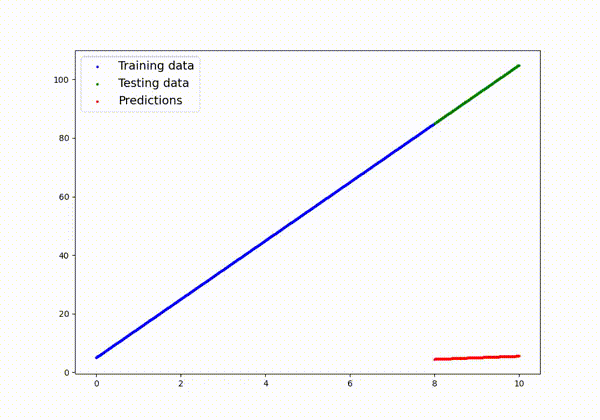

# IntroPyTorch

A comprehensive introduction to PyTorch fundamentals through linear regression, featuring automatic model training visualization.

## 📋 Overview

This project demonstrates core PyTorch concepts by implementing a **custom linear regression model from scratch**. It includes mechanisms for visualizing model predictions at each training epoch. This was a great thing to do because of graph visualization. I also plan to make neural network visualization in 3D, so that I can learn more about that too



## ✨ Features

- **Custom Linear Regression Model**: Built entirely with PyTorch's `nn.Module`
- **Training Visualization**: Real-time prediction plotting at configurable intervals
- **Flexible Training Loop**: Easy-to-modify training pipeline with inference mode optimization
- **L1 Loss Function**: Robust loss calculation with SGD optimizer
- **Train/Test Split**: Built-in data stratification for model evaluation

- **This project is completely based on the projects shown in the pythorch tutorial of 25 hours from free code camp: https://www.youtube.com/watch?v=V_xro1bcAuA**

## 🚀 Quick Start

### Prerequisites

```bash
pip install torch matplotlib numpy
pip install natsort opencv-python  # For video generation
```

### Basic Usage

```python
python main.py
```

This will:
1. Generate synthetic training data (y = 10x + 5)
2. Train the model for 950 epochs
3. Save prediction visualizations every epoch. You can ajust this by tabbing the ```if graph_movie: ``` conditional

## 📁 Project Structure

```
intropytorch/
├── main.py                          # Core training script
├── images/
│   └── movie_images/                # Auto-generated epoch visualizations
│       ├── epoch_000.png
│       ├── epoch_100.png
│       ├── epoch_200.png
│       └── ...
├── training_evolution.mp4           # Generated video (if enabled)
└── README.md
```

## 🔧 Model Architecture

### LinearRegressionModel

```python
class LinearRegressionModel(nn.Module):
    def __init__(self):
        super().__init__()
        self.weights = nn.Parameter(torch.randn(1))
        self.bias = nn.Parameter(torch.randn(1))
    
    def forward(self, x):
        return x * self.weights + self.bias
```

## 📈 Configuration

Modify these parameters in `main.py` to experiment:

```python
# Data generation
weight = 10          # True model weight
bias = 5             # True model bias
start = 0            # Data range start
end = 10             # Data range end
step = 0.01          # Data sampling step

# Training
epochs = 950         # Number of training iterations
lr = 0.01           # Learning rate (SGD optimizer)

## 📊 Training Output

```
Epoch: 0 | Loss: 156.2341 | Test Loss: 154.3210
Epoch: 100 | Loss: 12.5643 | Test Loss: 11.8932
Epoch: 200 | Loss: 2.1543 | Test Loss: 2.0234
...
Epoch: 900 | Loss: 0.0012 | Test Loss: 0.0011
```

The model converges as training progresses, with predictions (red points) aligning with test data (green points).

## 🎬 Viewing Generated Videos

After training completes, view your training evolution video using any standard video player:

```bash
# Using mpv (lightweight, recommended)
mpv training_evolution.mp4

# Using VLC
vlc training_evolution.mp4

# Or simply open in your file explorer
```

**Note**: The video displays the model's predictions improving frame-by-frame as it learns the underlying linear relationship.


